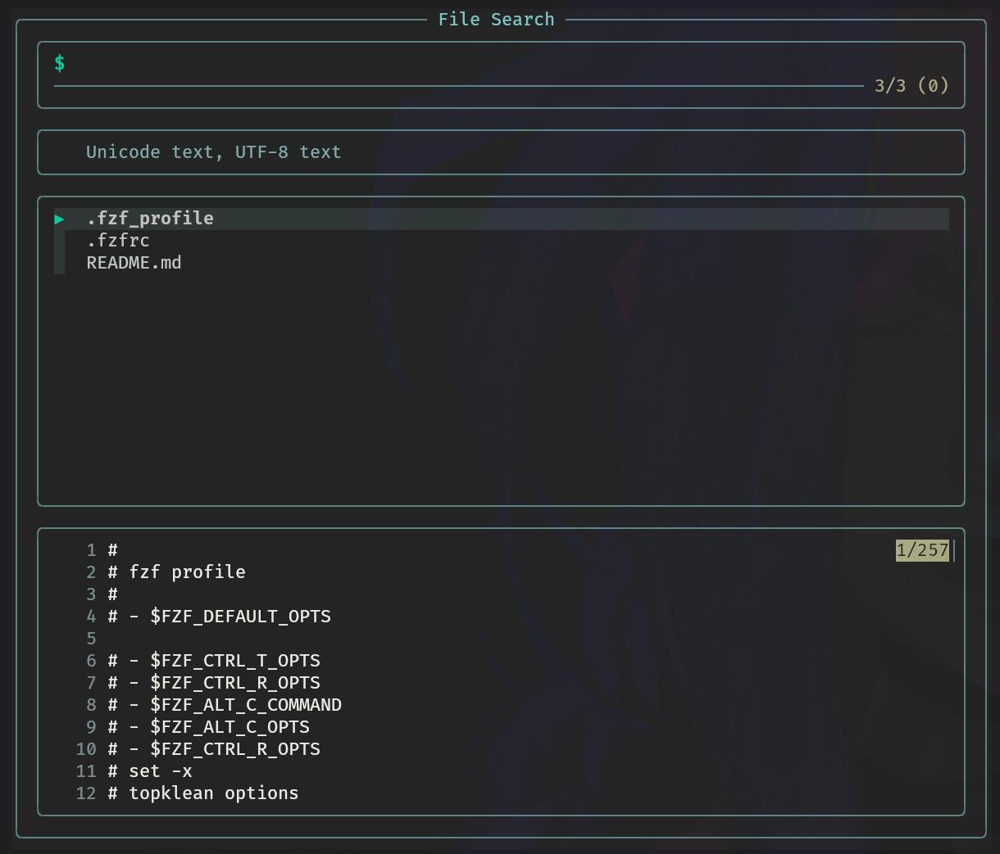

# FZF config

<picture>
    
    
    
</picture>

# Installation

## Functions
**fhelp()**  
	 list all fzf func  
	 3 first lines of the function must be  
	 the help  
  
**fman()**  
	 search all man  
	 MAN_PATH : arch linux and other, not every distro has this ENV VAR  
  
**fmank()**  
	 search strings in all man  
	 $1... strings to search  
  
**fyayOwner()**  
	 search for parckage owner of a file(s)  
	 args are prequery  
  
**fyayfilesfrompackage()**  
	 search in all packages installed  
	 for the selection,  search the files  
	 ls the files selection  
  
**fyayorphan()**  
	 find all orphans packages and list the selected (for now)  
  
**fsuid()**  
	 find all files with suid set (not in root)  
  
**fguid()**  
	 find all files with guid set (not in root)  
	  
**fsticky()**  
	 find all directory with stickybit set (not in root)  
	  
	  
